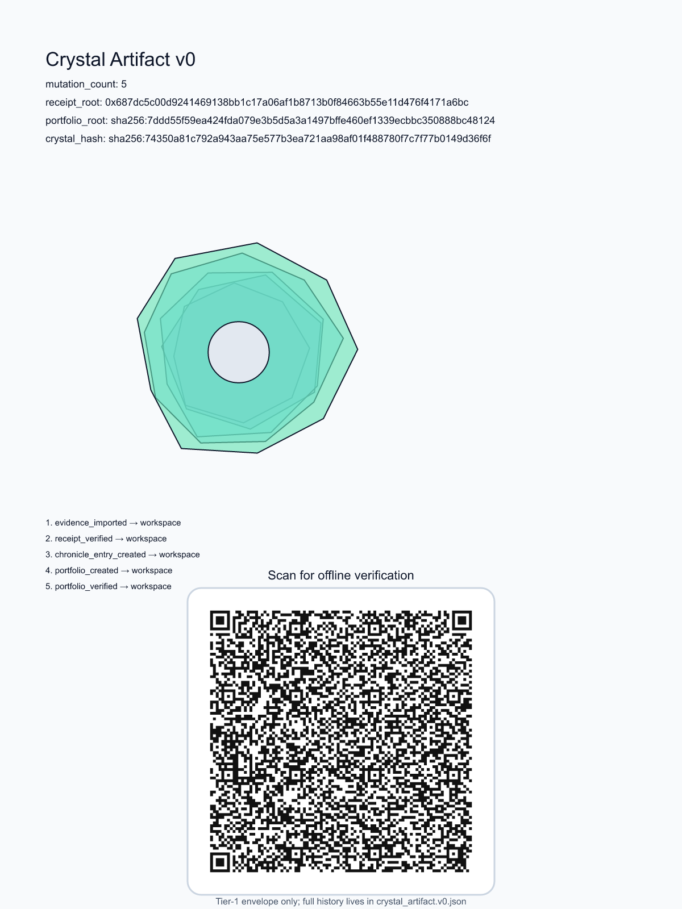
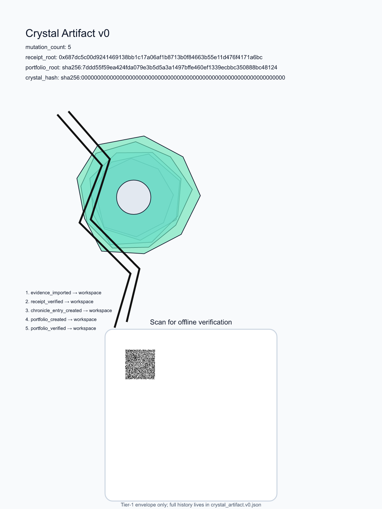
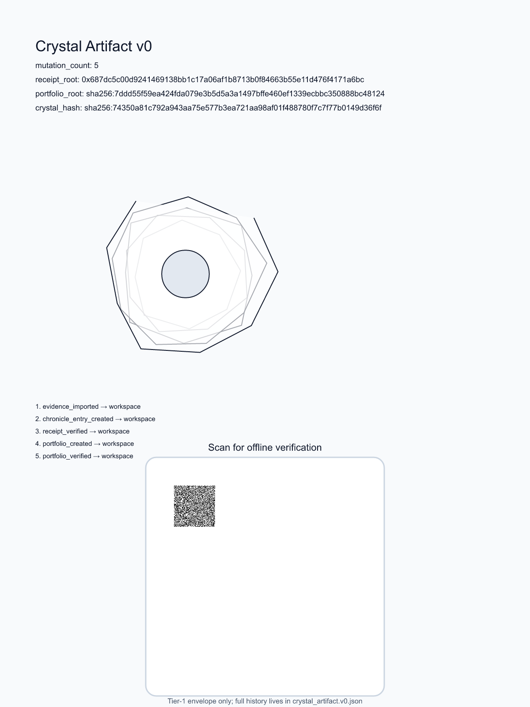
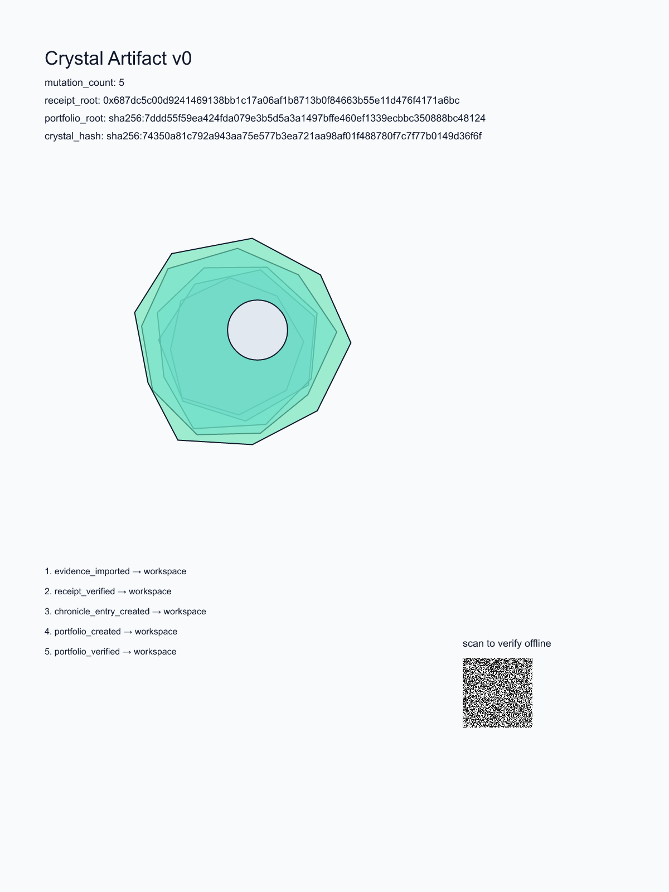
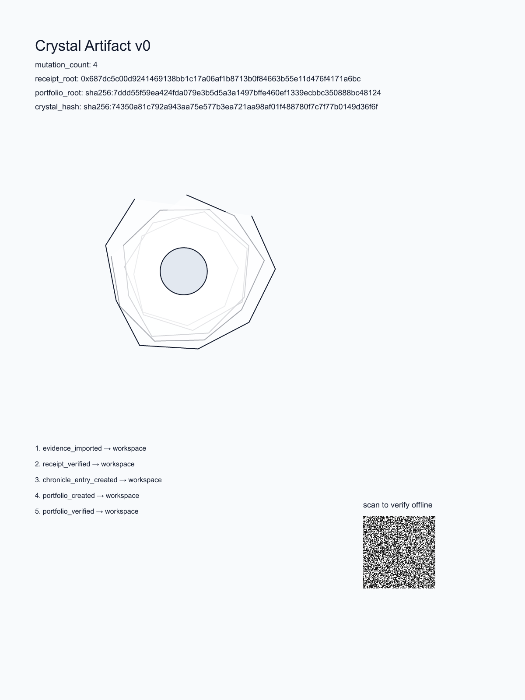

# crystal-artifact

Crystal Artifact is a deterministic bismuth-style visual artifact that encodes a ReceiptOS → Chronicle proof history. Each mutation becomes one growth layer around the evidence capsule. It is designed to be printable on paper and verifiable back by scanning. The crystal proves nothing by itself; it is a portable, recomputable carrier that points at proofs verified elsewhere. It is not an asset, not a credential, and not a reputation score.

## Example



5 mutations = 5 layers; the QR carries the minimal Tier-1 verification envelope for offline verification.

## Broken-state examples

A clean crystal is whole, symmetric, and closed. A broken crystal must look broken even in black-and-white print, using only defects that can be recomputed from the input JSON alone.

### Clean reference


### Hash mismatch — visible fracture



A stored `crystal_hash` that does not match the recomputed value creates a visible fracture across the form.

### Broken chain — ruptured outer layer



A missing, duplicated, or out-of-order mutation sequence opens the outer growth layer instead of closing it cleanly.

### Root inconsistency — offset inner core



If the input chain contradicts itself about `receipt_root`, the inner core sits visibly off-center.

### Incomplete history — unfinished shell



If the chain stops before `portfolio_verified`, the outer shell remains visibly incomplete.

## The chain it encodes

The current example follows this chain:

`Stealth evidence → ReceiptOS proof → portable_proof_object.v0 → chronicle_entry.v0 → chronicle_portfolio.v0`

The artifact records that history through five mutation types:

- `evidence_imported`
- `receipt_verified`
- `chronicle_entry_created`
- `portfolio_created`
- `portfolio_verified`

## How the hash works

The core invariant is the `crystal_hash`:

```text
crystal_hash = sha256(canonicalize({
  crystal_version,
  receipt_root,
  sorted mutation_hashes
}))
```

This hash deliberately excludes the SVG, timestamps, color, and visual parameters. The picture is derived from the history, but the picture does not define the history. That means the same proof history always yields the same `crystal_hash`, and a scanned copy can be recomputed and checked with zero trust. The guard test enforces this by injecting fake SVG, timestamp, and color fields and asserting that the `crystal_hash` stays byte-identical. The QR does not carry the full artifact anymore; it carries only the minimal Tier-1 envelope needed to recompute that same hash.

## Two-tier verification

Tier 1 is paper alone, offline: scan the QR, parse the minimal verification envelope, recompute `crystal_hash` from `{ crystal_version, receipt_root, mutation_hashes }`, and check that it matches the embedded value.

This is a role correction, not just a size optimization: the QR is the paper integrity check, not the full history container. The full history remains in the file.

Tier 2 uses the surrounding proof chain: open the full `crystal_artifact.v0.json`, recover the full mutations and `source_ref` values, and check them against real ReceiptOS and Chronicle outputs.

## Relationship to the ecosystem

This repository is an isolated experiment. It does not import `crystal-receipt` source and is not part of the ReceiptOS or Chronicle proof path; those systems remain the source of truth. The crystal is a secondary, optional visual representation. Its `canonicalize` function is a verified copy, locked to `crystal-receipt` by the golden-vector test so it cannot silently drift.

## Run it

```bash
bun install
bun test
bun run scripts/generate-example.ts
bun scripts/generate-broken-examples.ts
```
